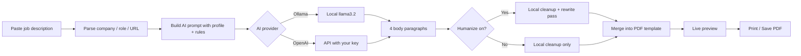

# Cover Letter Generator

[](https://github.com/AnujWadi-Git/cover-letter-generator)
[](#license)

A **free, single-file, client-side** cover letter generator built by [Anuj Wadi](https://anujwadi.com). 2026 Paste any job posting, generate a tailored letter with AI, preview it in a professional PDF layout, and save as PDF — no backend, no npm, no paid SaaS required.

| | |
|---|---|
| **Repository** | https://github.com/AnujWadi-Git/cover-letter-generator |
| **App file** | `cover-letter.html` (entire app in one file) |
| **Suggested URL** | `https://anujwadi.com/cover-letter.html` |

---

## Table of contents

- [Overview](#overview)
- [Why this exists](#why-this-exists)
- [Features](#features)
- [How it works](#how-it-works)
- [Quick start](#quick-start)
- [Detailed setup](#detailed-setup)
  - [Ollama (free, recommended)](#ollama-free-recommended)
  - [OpenAI (optional)](#openai-optional)
- [Step-by-step usage guide](#step-by-step-usage-guide)
- [Cover letter format](#cover-letter-format)
- [Humanize mode](#humanize-mode)
- [Customization guide](#customization-guide)
- [Deploy to anujwadi.com](#deploy-to-anujwadicom)
- [Deploy with GitHub Pages](#deploy-with-github-pages)
- [Data & privacy](#data--privacy)
- [Troubleshooting](#troubleshooting)
- [FAQ](#faq)
- [Tech stack & architecture](#tech-stack--architecture)
- [Project structure](#project-structure)
- [Author](#author)
- [License](#license)

---

## Overview

This tool automates the boring part of job applications: turning a raw job description into a **personalized, ATS-friendly cover letter** that matches your real background.

You only need to:

1. **Paste** the job posting  
2. **Wait** a few seconds while AI writes the letter  
3. **Preview** it on a US Letter page  
4. **Print / Save as PDF**

Everything runs in the browser. Your job text and letters are stored locally. AI runs either on **your machine** (Ollama, free) or via **your own OpenAI API key** (optional).

---

## Why this exists

Applying to many roles means rewriting the same cover letter over and over. This app:

- Keeps your **candidate profile** and **writing rules** baked in  
- Pulls **company, role, and URL** from pasted text automatically  
- Uses **Arizona timezone** for the letter date (`America/Phoenix`)  
- Outputs a letter that matches a **fixed professional PDF template** (header, salutation, 4 paragraphs, signature)  
- Includes a **humanize pass** so the writing sounds less robotic  

No Make.com, no ChatGPT copy-paste workflow, no monthly subscription.

---

## Features

### Core workflow

| Feature | Description |
|--------|-------------|
| **Paste-only input** | One large text area — paste from LinkedIn, Indeed, Greenhouse, Lever, company careers pages, etc. |
| **Auto-detect fields** | Parses company name, job title, and job URL from pasted text |
| **Auto-generate** | Starts generation 2 seconds after you stop typing (toggle on/off) |
| **Manual generate** | **Generate cover letter now** button anytime |
| **Live preview** | Full US Letter page preview, auto-scaled to fit the panel |
| **Print / PDF** | `window.print()` — UI hidden, only the letter prints |

### AI & writing quality

| Feature | Description |
|--------|-------------|
| **Ollama support** | Free local AI via [Ollama](https://ollama.com) — default model `llama3.2` |
| **OpenAI support** | Optional `gpt-4o-mini` or any model you configure |
| **4-paragraph structure** | Intro → company fit → experience/skills → closing |
| **ATS-friendly** | Plain text body, no bullets, keywords from job description |
| **Anti-buzzword rules** | Blocks phrases like "thrilled to apply", "leveraging", "cutting-edge" |
| **Humanize pass** | Local phrase cleanup + second AI rewrite for natural tone |
| **Revision loop** | Add feedback → regenerate or humanize again |

### PDF template

| Feature | Description |
|--------|-------------|
| **US Letter size** | 8.5 × 11 inches |
| **Centered header** | Name + contact line |
| **Dynamic date** | Short format, e.g. `Mar 17, 2026` |
| **Dynamic salutation** | `Dear Hiring Team at [Company],` |
| **Justified body** | Professional paragraph alignment |
| **Fixed closing** | Best, / Anuj Anil Wadi / anujwadi.com |

### Persistence & UX

| Feature | Description |
|--------|-------------|
| **localStorage** | Saves job text, letter, settings, feedback across refreshes |
| **Clear all** | Reset everything with confirmation |
| **Suggested filename** | `Cover Letter - Anuj Wadi - [Company] - [Role].pdf` |
| **Responsive layout** | Two columns on desktop, stacked on mobile |
| **Dark UI** | Modern app chrome; preview uses classic white paper |

---

## How it works



**What the AI writes:** only the **4 body paragraphs**.  
**What the HTML template adds:** header, date, salutation, closing, website link.

---

## Quick start

### 1. Clone the repo

```bash
git clone https://github.com/AnujWadi-Git/cover-letter-generator.git
cd cover-letter-generator
```

### 2. Install Ollama (free)

Download from [ollama.com](https://ollama.com), then:

```bash
ollama pull llama3.2
```

Keep the Ollama app running (menu bar on Mac).

### 3. Serve the file locally

```bash
python3 -m http.server 8765
```

Open: **http://localhost:8765/cover-letter.html**

> **Important:** Do not open the file as `file://`. Browsers block API calls to Ollama from `file://` URLs. Always use `http://localhost`.

### 4. Test AI connection

1. Expand **AI setup (one time)**  
2. Leave provider as **Ollama**  
3. Click **Test connection**  
4. You should see: `Connected. Model replied: OK`

### 5. Paste a job and go

Paste a full job posting → wait 2 seconds → review preview → **Print / Save as PDF**.

---

## Detailed setup

### Ollama (free, recommended)

| Setting | Default | Notes |
|--------|---------|-------|
| Provider | Ollama | Selected in AI setup |
| URL | `http://127.0.0.1:11434` | Ollama default port |
| Model | `llama3.2` | Change if you prefer another pulled model |

**Install steps (macOS):**

1. Download Ollama from https://ollama.com  
2. Open the app (runs in background)  
3. In Terminal:
   ```bash
   ollama pull llama3.2
   ollama list          # verify model is installed
   curl http://127.0.0.1:11434/api/tags   # verify server is up
   ```
4. In the cover letter app → **Test connection**

**Other models you can try** (after `ollama pull <name>`):

- `llama3.2` — good balance of speed and quality (default)  
- `mistral` — fast, decent for short text  
- `llama3.1:8b` — alternative if 3.2 is slow on your machine  

**Who can use Ollama?**

Only **you**, on **your computer**, while Ollama is running. If you host `cover-letter.html` on anujwadi.com, visitors cannot reach your local Ollama. This is a **personal tool**, not a public multi-user SaaS.

---

### OpenAI (optional)

Use this if you want higher quality without running Ollama, or when deploying publicly and each user brings their own key.

1. Get an API key: https://platform.openai.com/api-keys  
2. In the app → **AI setup** → select **OpenAI**  
3. Paste key (stored in **browser localStorage only**)  
4. Default model: `gpt-4o-mini` (cheap, fast)  
5. **Save settings** → **Test connection**

Costs are billed to your OpenAI account per letter generated (typically a few cents with `gpt-4o-mini`).

---

## Step-by-step usage guide

### First-time flow

```
┌─────────────────────────────────────────────────────────────┐
│  1. AI setup        → Test Ollama or add OpenAI key         │
│  2. Paste job       → Full posting from any site              │
│  3. Auto-generate   → Letter appears in preview (right)       │
│  4. Review          → Read all 4 paragraphs                   │
│  5. Save PDF        → Print / Save as PDF                     │
└─────────────────────────────────────────────────────────────┘
```

### Controls explained

| Control | What it does |
|--------|----------------|
| **Auto-generate after paste** | Waits 2 sec after typing stops, then generates |
| **Humanize writing** | Runs cleanup + extra AI rewrite (recommended) |
| **Generate cover letter now** | Manual trigger |
| **Regenerate with feedback** | Sends your notes + previous letter to AI |
| **Humanize again** | Re-runs humanize on current letter without full regen |
| **Clear all** | Wipes job, letter, feedback, and saved state |
| **Print / Save as PDF** | Opens browser print dialog |

### Validation rules

| Condition | Behavior |
|-----------|----------|
| Empty job description | Error — cannot generate |
| Under 100 characters | Warning — allows continue |
| Empty company / role | Falls back to `Company` / `Role` in prompt and filename |

### Revision workflow

1. Letter generated → **Need changes?** section appears  
2. Type feedback, e.g. *"Shorter opening, mention Python and Kafka, less formal"*  
3. Click **Regenerate with feedback**  
4. Or click **Humanize again** for tone-only polish  
5. When satisfied → **Print / Save as PDF**

---

## Cover letter format

The final PDF matches this structure:

```
                    ANUJ WADI
        awadi@asu.edu | 707-977-0567 | AZ, USA

Mar 17, 2026

Dear Hiring Team at [Company],

[Paragraph 1 — role, ASU degree, relevant skills]

[Paragraph 2 — why this company, alignment with their work]

[Paragraph 3 — JPMorgan / PrimaThink / projects + job technologies]

[Paragraph 4 — interest in contributing, thank you, EAD if relevant]

Best,
Anuj Anil Wadi
anujwadi.com
```

**Date timezone:** `America/Phoenix` (Arizona — no DST).  
**Body alignment:** justified in preview and print.

---

## Humanize mode

When **Humanize writing** is enabled (default), generation runs two extra steps:

### Step 1 — Local cleanup (no API)

Removes or replaces common AI tells, for example:

- "Furthermore", "Moreover", "Additionally"  
- "I am thrilled to apply", "Leveraging my expertise"  
- "passionate about", "cutting-edge", "results-driven"  
- Overused em-dashes and filler phrases  

### Step 2 — AI rewrite pass

A dedicated editor prompt rewrites the 4 paragraphs to:

- Vary sentence length  
- Use natural transitions  
- Allow light contractions (I'm, I've) where appropriate  
- Keep **all facts identical** — no invented experience  

### Honest note on "AI detection"

Humanize makes letters **read more naturally** for human recruiters. No tool can guarantee 0% on AI detector tools. **Always read and lightly edit** before sending — that is the most reliable way to make it yours.

---

## Customization guide

All customization is inside `cover-letter.html`. Search for these markers:

### 1. PDF styling — `COVER LETTER PDF TEMPLATE STYLES`

```css
.letter-page {
  padding: 0.85in 1in 1in 1in;   /* PAGE MARGIN */
  font-family: "Times New Roman", Times, serif;  /* FONT FAMILY */
  font-size: 11pt;                 /* FONT SIZE */
  line-height: 1.5;                /* LINE HEIGHT */
}

.letter-body p {
  margin: 0 0 1em 0;              /* PARAGRAPH SPACING */
  text-align: justify;              /* or left */
}

.letter-closing {
  margin-top: 1.1em;               /* SIGNATURE SPACING */
}
```

### 2. PDF HTML — `COVER LETTER PDF TEMPLATE`

Edit the fixed header and closing:

```html
<div class="letter-name">ANUJ WADI</div>
<div class="letter-contact">awadi@asu.edu | 707-977-0567 | AZ, USA</div>
...
<p class="letter-sign-name">Anuj Anil Wadi</p>
<p class="letter-website"><a href="https://anujwadi.com">anujwadi.com</a></p>
```

Salutation is built in JavaScript: `Dear Hiring Team at ${company},`

### 3. Candidate profile — `CANDIDATE_PROFILE`

Update your skills, education, internships, and experiences. The AI is instructed **never to invent** beyond this list:

```javascript
const CANDIDATE_PROFILE = `Candidate Name:
Anuj Anil Wadi
...
Possible Experiences:
- JPMorgan internship
- PrimaThink internship
...`;
```

Also update `COVER_LETTER_RULES` and `HUMANIZE_RULES` if you change writing style.

### 4. AI models

Defaults in the HTML:

| Provider | Default model |
|----------|---------------|
| Ollama | `llama3.2` |
| OpenAI | `gpt-4o-mini` |

Change in the UI under **AI setup**, or edit default `value` attributes in the HTML.

### 5. Branding / nav

Top nav links to `https://anujwadi.com`. Edit the `.site-nav` section to match your site.

---

## Deploy to anujwadi.com

### Option A — Single file upload (cPanel / FTP / Netlify)

1. Upload `cover-letter.html` to your web root (`public_html` or equivalent)  
2. Visit `https://anujwadi.com/cover-letter.html`  
3. Add a link from your portfolio homepage:

```html
<a href="/cover-letter.html">Cover Letter Tool</a>
```

### Option B — Clean URL (`/cover-letter/`)

1. Create folder `cover-letter/` on your server  
2. Rename `cover-letter.html` → `index.html` inside that folder  
3. URL becomes: `https://anujwadi.com/cover-letter/`

### Option C — Embed in existing site

If anujwadi.com is a React/Next site, you can:

- Host this file as a static route, **or**  
- Copy the letter template CSS/HTML into your existing layout  

The app does not require a build step — static hosting is enough.

### Using AI on the live site

| Scenario | Works? |
|----------|--------|
| You open anujwadi.com on **your Mac** + Ollama running | Yes |
| Visitor opens anujwadi.com, no Ollama | No — unless they add OpenAI key in settings |
| You use OpenAI key in browser on any device | Yes |

**Recommendation:** Use locally with Ollama for daily applications. Host on anujwadi.com as a portfolio demo / personal tool link.

---

## Deploy with GitHub Pages

1. Push this repo to GitHub (already done)  
2. Go to **Settings → Pages**  
3. Source: **Deploy from branch** → `main` / `/ (root)`  
4. Your app will be at:  
   `https://anujwadi-git.github.io/cover-letter-generator/cover-letter.html`

Rename to `index.html` if you want the shorter URL without the filename.

---

## Data & privacy

### What stays in your browser (localStorage)

Key: `coverLetterGenerator_v2`

| Saved field | Purpose |
|-------------|---------|
| `jobDescription` | Pasted posting |
| `company`, `role`, `jobUrl` | Parsed / detected fields |
| `coverLetter` | Generated body text |
| `revisionFeedback` | Your edit notes |
| `autoGenerate`, `enableHumanize` | Toggle states |
| `settings` | AI provider, URL, model, API key |

### What leaves your browser

| Provider | Data sent |
|----------|-----------|
| **Ollama** | Prompt (job text + profile + rules) → `localhost:11434` only |
| **OpenAI** | Same prompt → `api.openai.com` (if you configure a key) |

Nothing is sent to anujwadi.com servers — there are no servers in this project.

### Clear saved data

Click **Clear all** in the app, or in DevTools:

```javascript
localStorage.removeItem('coverLetterGenerator_v2');
```

---

## Troubleshooting

### "Cannot reach AI" / "Failed to fetch"

| Cause | Fix |
|-------|-----|
| Opened as `file://` | Use `python3 -m http.server 8765` |
| Ollama not running | Open Ollama app or run `ollama serve` |
| Model not pulled | Run `ollama pull llama3.2` |
| Wrong URL | Default: `http://127.0.0.1:11434` |

### Ollama test fails but Ollama works in terminal

- Check firewall is not blocking port 11434  
- Try model name exactly as shown in `ollama list`  
- Restart Ollama app  

### Letter sounds robotic

- Enable **Humanize writing**  
- Click **Humanize again**  
- Add specific feedback and **Regenerate**  
- Manually edit one sentence in the preview before printing  

### Preview cropped or too small

- Resize browser window (preview auto-scales)  
- Scroll inside the gray preview area if needed  
- Print output is always full size — preview scaling does not affect PDF  

### Company / role wrong after paste

- Parsed from first lines of posting — quality varies by site  
- Edit hidden fields via browser DevTools, or improve `parseJobPosting()` in the HTML  
- Regenerate after correcting company name in parsed tags (refresh may restore from localStorage)  

### OpenAI errors

| Error | Fix |
|-------|-----|
| Invalid API key | Regenerate key at platform.openai.com |
| Insufficient quota | Add billing / credits |
| Model not found | Change model name in settings |

---

## FAQ

**Q: Do I need to pay for anything?**  
A: No, if you use Ollama locally. OpenAI is optional and pay-per-use.

**Q: Can I use this for internships and new grad roles?**  
A: Yes — prompts are tuned for early-career / graduate student tone.

**Q: Will it invent fake jobs or skills?**  
A: Prompts explicitly forbid inventing experience. Always verify the letter before sending.

**Q: Can recruiters tell it was AI-assisted?**  
A: Possibly. Humanize helps; your manual review helps more.

**Q: Does it work on mobile?**  
A: Yes, layout stacks vertically. PDF preview and print work best on desktop.

**Q: Can I fork this for my own profile?**  
A: Yes — update `CANDIDATE_PROFILE`, header HTML, and `COVER_LETTER_RULES`.

**Q: Why Arizona date?**  
A: Author is based in Tempe, AZ. Change `America/Phoenix` in `getArizonaDateString()` and `getLetterDateString()` if needed.

---

## Tech stack & architecture

| Layer | Technology |
|-------|------------|
| Markup / style / logic | Single `cover-letter.html` file |
| AI (local) | Ollama REST API `/api/chat` |
| AI (cloud) | OpenAI Chat Completions API |
| Storage | `localStorage` |
| PDF output | Browser print (`window.print()` + `@media print` CSS) |
| Date | `Intl.DateTimeFormat` with `America/Phoenix` |

### Explicitly NOT used

- React, Next.js, Vue, Angular  
- Node.js backend, Express, serverless functions  
- npm, webpack, build tools  
- Database (Postgres, Firebase, etc.)  
- External CDN scripts or fonts  
- Make.com, Zapier, paid cover letter SaaS  

### Code sections inside `cover-letter.html`

| Section | Purpose |
|---------|---------|
| `APP UI STYLES` | Dark theme, layout, forms, buttons |
| `COVER LETTER PDF TEMPLATE STYLES` | Print layout, margins, fonts |
| `COVER LETTER PDF TEMPLATE` | Header, body container, signature |
| `CANDIDATE_PROFILE` | Your background for AI context |
| `COVER_LETTER_RULES` | Generation prompt rules |
| `HUMANIZE_RULES` | Second-pass rewrite rules |
| `parseJobPosting()` | Extract company / role / URL |
| `fitPreviewScale()` | Scale preview to fit panel |
| `generateCoverLetter()` | Main AI flow |

---

## Project structure

```
cover-letter-generator/
├── cover-letter.html    # Complete application (~1,700 lines)
└── README.md            # This documentation
```

No `package.json`, no `node_modules`, no build folder.

---

## Author

**Anuj Anil Wadi**  
AI / Robotics Engineer · Arizona State University  

| | |
|---|---|
| Website | [anujwadi.com](https://anujwadi.com) |
| Email | awadi@asu.edu |
| GitHub | [AnujWadi-Git](https://github.com/AnujWadi-Git) |
| Education | M.S. Robotics & Autonomous Systems (AI), ASU |
| Location | Tempe, Arizona |

**Experience referenced in letters:** JPMorgan Chase (SWE intern), PrimaThink (AI Full Stack), AI/ML & robotics projects.

---

## License

MIT — free to use, modify, and host for personal or portfolio purposes.

If you fork this project, update the candidate profile and PDF header with your own information.

---

<p align="center">
  <strong>⭐ Star this repo if it saves you time on job applications.</strong><br>
  <a href="https://github.com/AnujWadi-Git/cover-letter-generator">github.com/AnujWadi-Git/cover-letter-generator</a>
</p>
